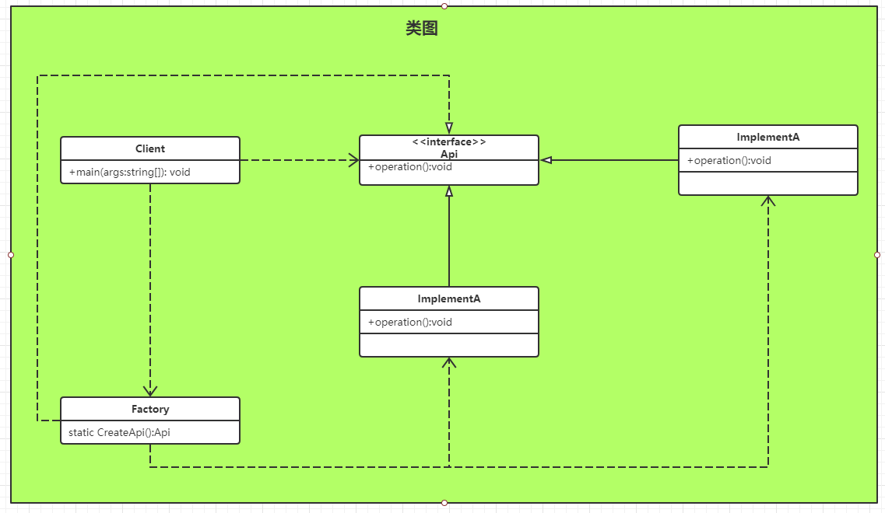
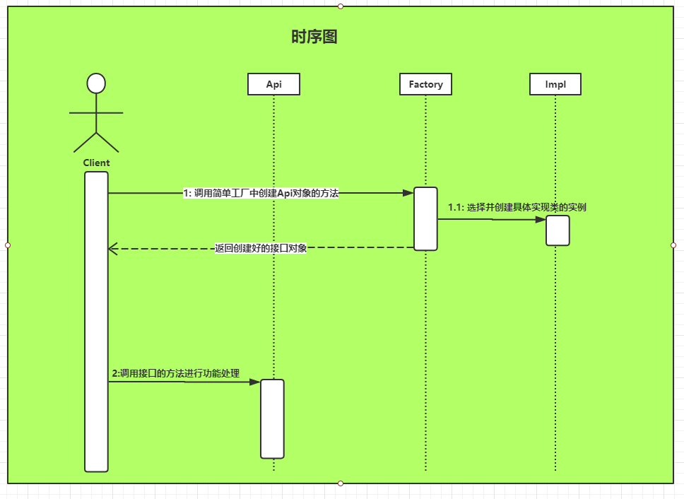

Title: 创建型 - 简单工厂模式 - SimpleFactory
Published: 2019-10-11
Tags: ["Design Pattern","Creational Pattern "]
---
### 定义
提供一个创建对象实例的功能，而无需关心其具体的实现。被创建的实例的类型可以是接口、抽象类、也可以是具体的类

### 类图

### 顺序图

### 示例代码
GitHub: [SimpleFactory](https://github.com/nightqbk/NK.DesignPattern/tree/master/NK.CreationalPatterns/NK.CreationalPatterns.SimpleFactory)

### 分析

#### 1. 简单工厂的功能

简单工厂就是用来创造东西的，可以用来创建接口，亦可以用来创建抽象类或者普通类的实例

#### 2. 静态工厂

使用简单工厂的时候，没有必要创建工厂类的实例，因此可以把简单工厂累实现成一个工具类，直接使用静态方法就可以了。也就是说简单工厂的方法**通常是静态的**, 所以也被称为静态工厂。如果要防止客户端无畏的创建简单工厂实例，还可以把简单工厂的**构造方法私有化**。

#### 3. 万能工厂

一个简单工厂可以包含很多用来构造东西的方法，这些方法可以创建不同的接口、抽象类或者实例类。一个简单工厂理论上可以构造任何东西，所以又被称为‘万能工厂’。

虽然在例子中的简单工厂累里只有一个方法，但事实上，是可以有很多这样的创建方法的。

#### 4. 简单工厂创建对象的范围

虽然从理论上讲，简单工厂什么都能创建，但是对于简单工厂可创建对象的范围，通常不要太大，最好控制在一个独立的组件级别或者一个模块级别，也就是一个组件或者模块简单工厂。否则这个简单工厂累会职责不明，有点大杂烩的感觉。

#### 5. 使用时机

1. 如果想要完全封装隔离具体实现，让外部只能通过接口来操作封装体，那么可以选用简单工厂，让客户端通过工厂来获取相应的接口，而无需关心具体的实现。
2. 如果想要把对外创建对象的职责集中管理和控制，可以选用简单工厂，一个简单工厂可以创建很多的、不相关的对象，可以把对外创建对象的职责集中到一个简单工厂来，从而实现集中管理和控制。

#### 6. 相关模式

##### 6.1 简单工厂和抽象工厂模式

**简单工厂**是用来选择实现的，可以选择任意接口实现。一个简单工厂可以有多个用于选择并创建对象的方法，多个方法创建的对象可以有关系也可以没有关系。

**抽象工厂**是用来选择**产品簇**的实现的，也就是说一般抽象工厂里面有多个用于选择并创建对象的方法，但是这些方法所创建的对象之间通常是有关系的，这些被创建的对象通常是构成一个产品簇所需要的部件对象。

所以从某种意义上来说，简单工厂和抽象工厂是类似的，如果抽象工厂退化成为只有一个实现，部分层次，那么就相当于简单工厂了

##### 6.2 简单工厂和工厂方法模式

简单工厂和工厂方法模式也是非常类似的。

**工厂方法**的本质也是用来选择实现的，**跟简单工厂的区别在于工厂方法是把选择具体实现的功能延迟到子类去实现**。如果把工厂方法中选择实现放到父类直接实现，那就等于简单工厂。

##### 6.3 简单工厂和能创建对象的模式

简单工厂的本质是选择实现，所以它可以跟任何其他能够创建对象实例的模式配合使用，比如：单例模式、原型模式、生成器模式等。

