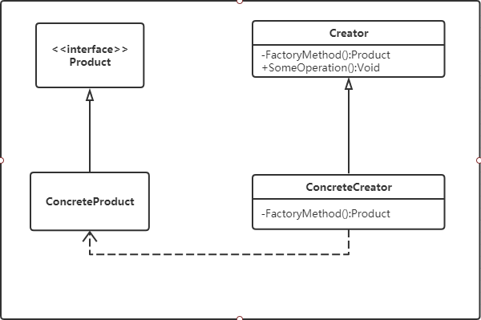
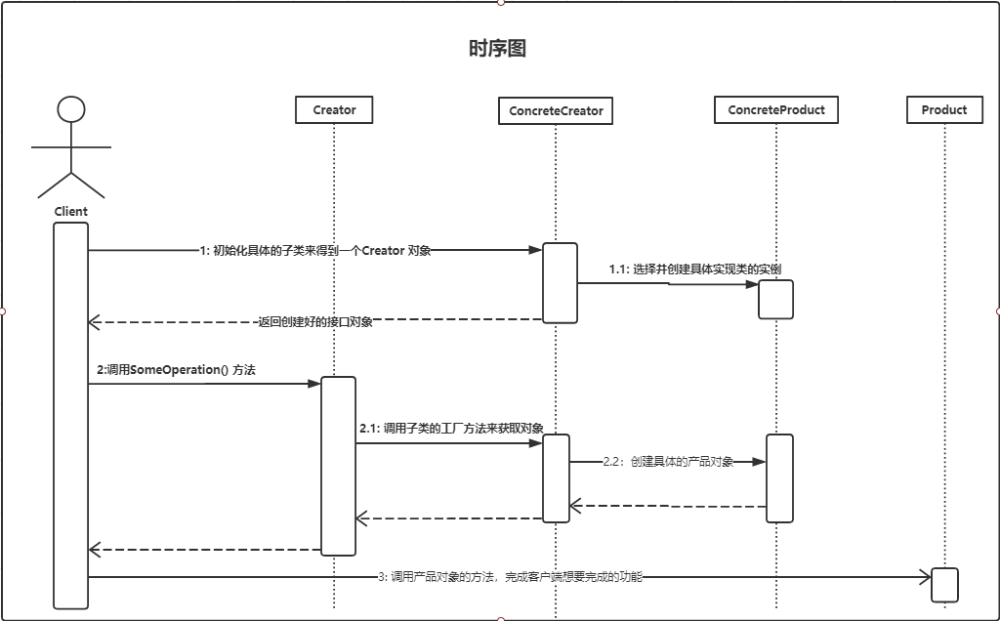

Title: 创建型 - 工厂方法 - FactoryMethod
Published: 2019-10-12

Tags: ["Design Pattern","Creational Pattern "]
---
### 定义
定义一个用于创建对象的接口，让子类选择实例化哪一个类，Factory Method 使一个类的实例化延迟到子类

### 示例代码
GitHub: [FactoryMethod](https://github.com/nightqbk/NK.DesignPattern/tree/master/NK.CreationalPatterns/NK.CreationalPatterns.FactoryMethod)

### 类图

- Product: 定义工厂方法所创建的接口，也就是实际需要使用的对象的接口。
- ConcreteProduct: 具体的Product 接口的实现对象
- Creator: 创建器，声明工厂方法，工厂方法通常会返回一个Product 类型的实例对象，而且多是抽象方法。
- ConcreteCreator: 具体的创建器对象，覆盖实现 Creator 定义的工厂方法，返回具体的Product 实例
### 顺序图

### 分析

#### 1. 工厂方法模式的功能

工厂方法模式的主要功能是让父类在不知道具体实现的情况下，完成自身的功能调用；而具体的实现延迟到子类来实现。

这样在设计的时候，不用去考虑具体的实现，需要摸个对象，就把它从工厂方法返回，在使用这些对象实现功能的时候还是通过接口来操作，这类似于 **IoC/DI** 的思想。

#### 2. 谁来使用工厂方法创建的对象

**这里首先要弄明白一件事，就是谁在使用工厂方法创建的对象？**
​事实上，在工厂方法模式中，应该是 Creator 中的其他方法在使用工厂方法创建的对象，虽然也可以把工厂方法创建的的对象直接提供给 Creator 外部使用，但工厂方法模式的本意，是由 Creator 对象内部的方法来使用工厂方法创建的对象，也就是说，**工厂方法一般不提供 Creator 外部使用。**

**客户端应该使用 Creator 对象， 或者是使用由 Creator 创建出来的对象。**

- 对于客户端使用 Creator 对象，这个时候工厂方法创建的对象，是被 Creator 中的某些方法使用；可以理解为操作，而且这些方法一般不方法应用类型。

- 对于使用那些由 Creator 创建出来的对象，这个时候工厂方法创建的对象，也是被 Creator 中的某些方法使用的；只是在这些方法中，会对工厂方法创建的对象做一些处理，然后返回给客户端使用。

#### 3. 工厂方法的优缺点

##### 3.1 优点

###### 可以在不知具体实现的情况下编程

工厂方法模式可以让你在实现功能的时候，如果需要某个产品对象，只需要使用产品的接口即可，而无需关心具体的实现。选择具体实现的任务延迟到子类去完成。

###### 更容易扩展对象的新版本

工厂方法给子类提供了一个挂钩 (hook) ，使得扩展新的对象版本变的非常容易。比如扩展一个新的实现，只需要实现一个新的子类来提供工厂方法实现，然后在客户端调用这个新的子类即可

##### 3.2 缺点

###### 具体产品对象和工厂方法的耦合性

在工厂方法模式中，工厂方法是需要创建产品对象的，也就是需要选择具体的产品对象，并创建他们的实例，因此具体产品对象和工厂方法是耦合的

#### 4. 何时选用工厂方法模式

- 如果一个类需要创建某个接口的对象，但是又不知道具体的实现，这种情况下可以选用工厂方法模式，把创建对象的工作延迟到子类中去实现
- 如果一个类本身就希望由它的子类来创建所需要的对象的时候，应该使用工厂方法模式

#### 5. 相关模式

##### 5.1 工厂方法模式和抽象工厂模式

这两个模式可以组合使用

##### 5.2 工厂方法模式和模板方法模式

这两个模式外观类似，都有一个抽象类，然后由子类来提供一些实现，但是工厂方法模式的子类专注的是创建产品对象，而模板方法模式的子类专注的是为固定的算法提供某些步骤的实现。

这两个木事可以组合使用，通常在模板方法模式里面，使用工厂方法来创建模板方法需要的对象。

