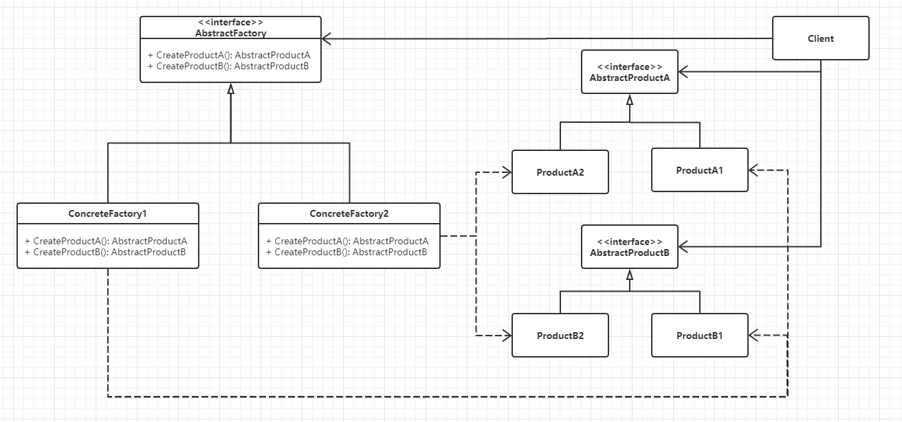

Title: 创建型 - 抽象工厂 - AbstractFactory
Published: 2019-10-12

Tags: ["Design Pattern","Creational Pattern "]
---
### 定义
提供一个创建 **一系列** 相关或相互依赖的对象的接口，而无需指定他们具体的类。

### 示例代码
GitHub: [AbstractFactory](https://github.com/nightqbk/NK.DesignPattern/tree/master/NK.CreationalPatterns/NK.CreationalPatterns.AbstractFactory)

### 类图

- Abstract Factory: 抽象工厂，定义创建一系列产品对象的操作接口。
- Concrete Factory: 具体的工厂，实现抽象工厂定义的方法，具体实现一系列产品对象的创建。
- Abstract Product: 定义一类产品对象的接口。
- Concrete Product: 具体的产品实现对象，通常在具体工厂里面，会选择具体的产品实现对象，来创建符合抽象工厂定义的方法返回的产品类型的对象
- Client：客户端，主要使用抽象工厂来获取一系列所需要的产品对象，然后面向这些产品对象的接口编程，以实现所需要的功能
### 顺序图

### 分析

#### 1. 抽象工厂模式的功能

抽象工厂的功能是为一系列相关对象或相互依赖的对象创建一个接口。一定要注意，这个接口内的方法不是任意堆砌的，而是一系列相关或相互依赖的方法。

从某种意义上看，抽象工厂其实是一个产品系列，或者是产品簇。组装电脑的例子就可以看成电脑簇，每个不同的装机方法，代表一种具体的电脑硬件系列。

#### 2. 使用工厂方法

AbstractFactorm 定义了创建产品所需要的接口，具体的实现是在实现类里面，通常在实现类里面就需要选择多种更具体的实现。所以 AbstractFactory 定义的创建产品的方法可以看成是工厂方法，而这些工厂方法的具体实现就延迟到了具体的工厂方法里面。也就是说使用工厂方法来实现抽象工厂

#### 3. 切换产品簇

由于抽象工厂定义的一系列对象通常是相关或者相互依赖的，这些产品对象就构成了一个产品簇，也就是抽象工厂定义了一个产品簇。

这就带来了非常大的灵活性，切换一个产品簇的时候，只需要提供不同的抽象工厂实现就可以了，也就是说现在产品是以产品簇作为一个整体被切换。

#### 4. 抽象工厂和数据访问层

#### 5. 抽象工厂的优缺点

##### 5.1 优点

**分离接口和实现**

客户端使用抽象工厂来创建需要的对象，而客户端根本就不知道具体的实现是谁，客户端只是面向产品的接口编程而已。也就是说，客户端从具体的产品实现中解耦

**使得切换产品簇变得容易**

因为一个具体的工厂实现代表的是一个产品簇。客户端选用不同的工厂实现，就相当于是在切换不同的产品簇

##### 5.2 缺点

**不太容易扩展新的产品**

如果需要给整个产品簇添加一个新的产品，那么久需要修改抽象工厂，这样就会导致修改所有的工厂实现类。

**容易找出层次复杂**

在使用抽象工厂模式的时候，如果需要选择的层次过多，那么会造成整个累层次变的复杂。

#### 5. 抽象工厂的本质

工厂方法是选择单个产品的实现，虽然一个类里面可以有多个工厂方法，但是这些方法之间一般是没有联系的，即使看起来像有联系。

但是抽象工厂着重的就是为一个产品簇选择实现，定义在抽象工厂里面的方法通常是有联系的，他们都是产品的某一部分或者是相互依赖的。如果抽象工厂里面只定义一个方法，直接创建产品，那么久退化为工厂方法了。

#### 6. 何时选用抽象工厂模式

- 如果希望一个系统独立于他的产品的创建、组合和表示的时候。换句话说，希望一个系统只是知道产品的接口，而不关心实现的时候
- 如果一个系统要由多个产品系列中的一个来配置的时候。换句话说，就是可以动态的切换产品簇的时候 (比如多个数据库)
- 如果要强调一系列相关产品的接口，以便联合使用他们的时候。

#### 7. 相关模式

**抽象工厂模式和工厂方法模式**

这两个模式即有区别，又有联系，可以组合使用。

工厂方法模式一边是针对单独的产品对象的创建，而抽象工厂模式注重产品簇对象的创建，这是他们的区别

如果把抽象工厂创建的产品簇简化，这个产品簇只有一个产品，那么这个时候的抽象工厂和工厂方法差不多，也就是抽象工厂可以退化成工厂方法，而工厂方法又可以退化成简单工厂，这也是他们的联系。

在抽象工厂的实现中，还可以使用工厂方法来提供抽象工厂的具体实现，也就是说它们可以组合使用。

**抽象工厂模式和单例模式**

这两个模式可以组合使用。

在抽象工厂模式里面，具体的工厂实现，在整个应用中，通常一个产品簇系列只需要一个实例就可以了，因此可以把具体的工厂实现成为单例

