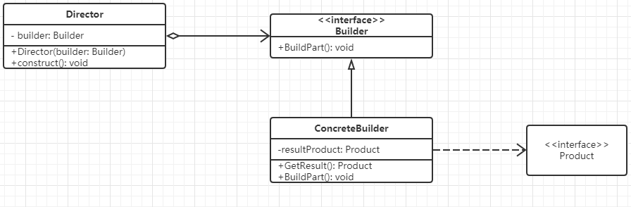
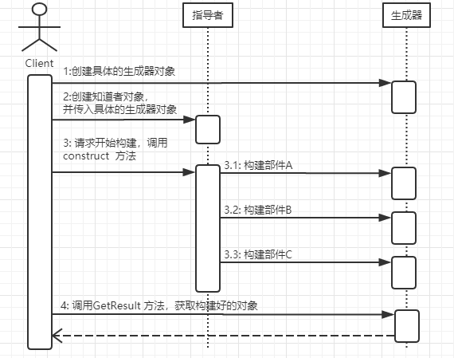

Title: 创建形 - 生成器模式 - Builder
Published: 2019-10-16

Tags: ["Design Pattern","Creational Pattern "]
---
### 定义
将一个复杂对象的构建与它的表示分离，使得同样的构建过程可以创建不同的表示

### 示例代码
GitHub: [Builder](https://github.com/nightqbk/NK.DesignPattern/tree/master/NK.CreationalPatterns/NK.CreationalPatterns.Builder)

### 类图

- **Builder**: 生成器接口，定义创建一个 Product 对象所需要的各个部件的操作
- **ConcreteBuilder**: 具体的生成器实现，实现各个部件的创建，并负责组装 **Product** 对象的各个部件，同时还提供一个让用户获取组装完成后的产品对象的方法
- **Director** : 指导者， 也被称为导向者，主要用来使用 **Builder** 接口，以一个统一的过程来构建所需要的 **Product** 对象
- **Product **: 产品，表示被生成器构建的复杂对象，包含多个部件
### 顺序图

### 分析

#### 1. 生成器模式的功能

生成器模式的主要功能是构建复杂的产品，而且是细化的、分步骤的构建产品，也就是生成器模式重在一步一步解决构建复杂对象的问题。如果仅仅这么认识生成器模式功能是不够的

> 更为中要的是，这个构建的过程是统一的、固定不变的，变化的部分放到生成器部分了，只要配置不同的生成器，那么同样的构建过程，就能构建出不同的产品来。

生成器模式的重心在于分离构建算法和具体的构造实现，从而使得构建算法可以重用。具体的构造实现可以很方便的扩展和切换，从而可以灵活的组合来构造不同的产品对象。

#### 2. 生成器模式的构成

特别要注意的是，生成器模式分成两个很重要的部分

- 一个部分是 Builder 接口，这里定义了如何构建各个部分，也就是知道每个部件功能如何实现，以及如何装配这些部件到产品中去;
- 第二部分是 Direcotr, Director 是知道如何组合来构建产品，也就是说 Director 负责整体的构建算法，而且通常是分步骤地来执行。

不过如何变化， Builder 模式都存在这么两个部分， **一个部分是部件构造和产品装配，另一个部分是整体构建的算法**. 认识这点是很重要的，因为在生成器模式中，强调的是固定整体构建的算法，而灵活扩展和切换部件的具体构造和产品装配的方式，所以要严格区分这两个部分。

#### 3. 生成器模式的本质

生成器模式的本质： 分离整体构建算法和部件构造

##### 4. 合适选用生成器

- 如果创建对象的算法，应该独立于改对象的组成部分以及它们的装配方式时。
- 如果同一个国建过程有这不同的表示时。

##### 5. 相关模式

###### 5.1 生成器和工厂方法模式

这两个模式可以组合使用。

生成器模式的 Builder 实现中，通常需要选择具体的部件实现。一个可行的方法就是实现成为工厂方法，通过工厂方法来获取具体的部件对象，然后再进行部件的装配。

###### 5.2 生成器模式和抽象工厂模式

这两个模式既相似又有区别，也可以组合使用。

在生成器模式的 Builder 实现中，需要创建各个部件对象，而这些部件对象是有关联的，通常是构成一个复杂对象的部件对象。也就是说，Builder 实现中，需要获取构成一个复杂对象的产品簇，那自然就可以使用抽象工厂模式来实现。这样一来，抽象工厂模式负责了部件对象的创建，Builder 实现里面则主要负责产品对象整体的构建了。

###### 5.3 生成器模式和模板方法模式

这也是两个非常类似的模式。初看之下，不会觉得这两个模式有什么关联。但是仔细一思考，却发现两个模式在功能上很类似，模板方法模式主要是用来定义算法的骨架，把算法中某些步骤延迟到子类中实现。在想象生成器模式， Director 用来定义整体的构建算法，把算法中某些涉及到具体部件对象的创建和装配的功能，委托给具体的Builder 来实现。

虽然生成器不是延迟到子类，是委托给 Builder， 但那只是具体实现方式上的差别，从本质上看两个模式很类似，都是定义一个固定的算法骨架，然后把算法中某些具体的步骤交给其他类来完成，都实现整体算法步骤和某些具体步骤实现的分离。

当然这两个模式也有很大的区别，首先是模式的目的，生成器模式是用来构建复杂对象的，而模板方法是用来定义算法骨架，尤其是一些复杂的业务功能的处理算法的骨架；其次是模式的实现，生成器模式是采用委托的方法，而模板方法采用的是继承的方式；另外从使用的复杂度上，生成器模式需要组合Director 和 Builder 对象，然后才能开始构建，要等构建完成后才能获得最终的对象，而模板方法就没有这么麻烦，直接使用子类对象即可。

###### 5.4 生成器模式和组合模式

这两个模式可以组合使用

对于复杂的组合结构，可以使用生成器模式来一步一步构建

