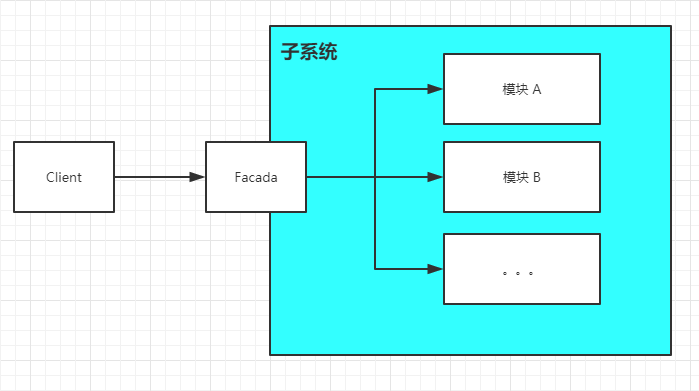
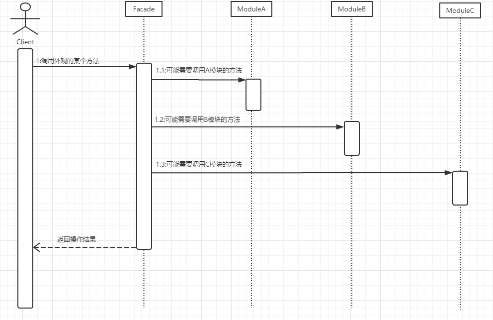

Title: 结构型 - 外观模式 - Facade
Published: 2019-10-17

Tags: ["Design Pattern","Creational Pattern "]
---
### 定义
为子系统中的一组接口提供一个一致的界面，Facade 模式定义了一个高层接口，这个接口使得这一子系统更加容易使用

### 示例代码
GitHub: [Facade](https://github.com/nightqbk/NK.DesignPattern/tree/master/NK.StructurePatterns/NK.StructurePatterns.Facade)

### 结构图

- **Facade**: 定义子系统的多个模块的高层接口，通常需要调用内部多个模块，从而把客户的请求代理给适当的子系统对象
- **模块**: 接受 Facade 对象的委托，真正实现功能，各个模块直接可能有交互。但是请注意，Facade 对象知道各个模块，**但是各个模块不应该知道 Facade 对象**
### 顺序图

### 分析

#### 1. 外观模式的目的

外观模式的目的不是给子系统添加新的功能接口，而是为了让外部减少与子系统内多个模块的交互，松散耦合，从而让外部能够更简单的使用子系统。

**需要特别注意：**

外观模式是当做子系统对外的接口出现的，虽然也可以在这里定义一些子系统没有的功能，但是不建议这么做。外观应该是包装已有的功能，**它主要负责组合已有功能来实现客户需求，而不是添加新的实现**。

#### 2. 使用外观模式和不使用外观模式相比有何变化

> 看到 Facade 的实现， 可能有些盆友会所说，这不就是把原来在客户端的代码搬到 Facade 里面了吗？ 没有什么大的变化啊？

表面上看就是把客户端的代码搬到 Facade 里面了，但实质是发生了变化的。

> 请思考： Facade 到底位于何处呢？ 是位于客户端还是在由 A、B、C 模块组成的系统这边？

答案肯定是在系统这边，这有什么不一样吗？

- Facade 在系统这边说明 Facade 内聚了功能的实现，如果以后要调整，只要调整 Facade 就好了，不需要调整客户端
- Facade 的功能可以背很多个客户端调用
- 对使用 Facade 的使用人员来说，Facade 打打节省了他们的学习成本，他们只需要了解Facade 就好了，并不需要了解子模块的功能

#### 3. 外观模式的优缺点

**优点**

- 松散耦合
- 简单易用
- 更好的划分访问的层次

**缺点**

过多的或者是不太合理的 Facade 也容易让人迷惑。到底是调用 Facade 好呢，还是直接调用模块好。

#### 4. 外观模式的本质

封装交互，简化调用

#### 5. 何时使用外观模式

- 如果你希望为一个复杂的子系统提供一个简单接口的时候，可以考虑使用外观模式。使用外观对象来实现大部分客户端需要的功能，从而简化客户的使用
- 如果想要让客户程序和抽象类的实现部分松散耦合，可以考虑使用外观模式，使用外观对象来将这个子系统与它的客户端分离开来，从而提高子系统的独立性和可移植性。
- 如果构建多层结构的系统，可以考虑使用外观模式，使用外观对象作为每层的入口，这样可以简化层间调用，也可以松散层次之间的依赖关系。

#### 6. 相关模式

**外观模式和中介者模式**

这两个模式非常类似，但是却有本质的区别。

**中介者模式主要用来封装对个系统之间相互的交互**， 多个在系统内部的多个模块之间；而外观模式封装的是单向的交互，是从客户端访问系统的调用，没有从系统中来访问客户端的调用。

**在中介者模式的实现里面**, 是需要实现具体的交互功能的；而外观模式的实现里面，一般是组合调用或是转内部实现的功能，通常外观模式本身并不实现这些功能。

**中介者模式的主要目的是松散多个模块之间的耦合**，把这些耦合关系全部放到中介者去实现；而外观模式的目的是简化客户端的调用。

**外观模式和单例模式**

通常一个子系统只需要一个外观实现，所以外观模式可以和单例模式组合使用，把 Facade 类实现成为单例。

**外观模式和抽象工厂模式**

外观模式的外观类通常需要和系统内部的多个模块交互，每个模块一般都有自己的接口，所以在外观类的具体实现里面，需要获取这些接口，然后组合这些接口来完成客户端的功能。

这个时候就可以和抽象工厂一起使用了，外观类通过抽象工厂来获取所需要的接口，而抽象工厂也可以把模块内部的实现对 Facade 进行屏蔽，也就是说 Facade 也仅仅只是知道它从模块中获取它需要的功能，模块内部的细节，Facade 也不知道。

