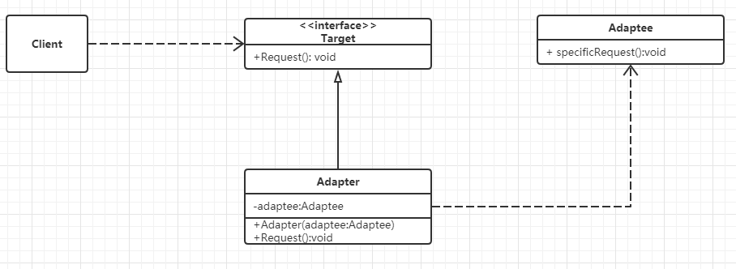
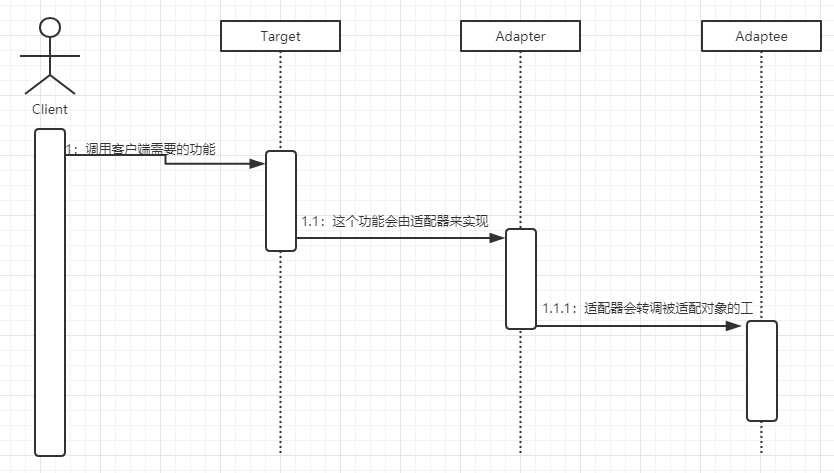

Title: 结构型 - 适配器 - Adapter
Published: 2019-10-17

Tags: ["Design Pattern","Structural Pattern "]
---
### 定义
将一个类的接口转换成客户希望的另一个接口。适配器模式使得原本由于接口不兼容而不能一起工作的那些类可以一起工作

### 示例代码
GitHub: [Adapter](https://github.com/nightqbk/NK.DesignPattern/tree/master/NK.StructuralPatterns/NK.StructuralPatterns.Adapter)

### 结构图

- **Client**: 客户端，调用自己需要的领域接口 Target
- **Target**: 定义客户端需要的跟特定领域相关的接口
- **Adaptee**: 已经存在的接口，通常能满足客户端的功能要求，但是接口与客户端要求的特定领域接口不一致，需要被匹配。
- **Adapter**：适配器，把 Adaptee 适配成 Client 需要的 Target
### 顺序图

### 分析

#### 1. 模式的功能

适配器模式的主要功能是进行**转换匹配，目的是复用已有的功能**， 而不是来实现新的接口。也就是说，客户端需要的功能应该是已经实现好了的，不需要适配器模式来实现，适配器模式主要负责把不兼容的接口转换成客户端期望的样子就可以了。

但这并不是说，在适配器里面就不能实现功能。适配器里面可以实现功能，称这种适配器为智能适配器。再说了，在接口匹配和转换过程中，也有可能需要额外实现一定的功能，才能转换过来，比如需要调整参数以进行匹配等。

#### 2. 对象组合

适配器的实现方式其实是依靠对象组合的方式。通过给适配器对象组合被适配的对象，然后当客户端调用 Target 的时候，适配器会把相应的功能委托给被适配的对象去完成。

#### 3. 适配器的优缺点

**优点**

- 更好的复用性

  > 如果功能是已经有了的，只是借口不兼容，那么通过适配器模式就可以让这些功能得到更好的复用

- 更好的扩展

  > 在实现适配器功能的时候，可以调用自己开发的功能，从而自然的扩展系统的功能

**缺点**

- 过多的使用适配器，会让系统非常零乱，不容易整体进行把握

#### 4. 适配器的本质

适配器的本质是：**转换匹配，复用功能。**

> 适配器通过转换调用已有的实现，从而能把已有的实现匹配成需要的接口，使之能满足客户端的需要。也就是说转换匹配是手段，而复用已有的功能才是目的。
>
> 在进行转换匹配的过程中，适配器还可以在转换调用的前后实现一些功能处理，也就是实现智能的适配

#### 5. 何时使用适配器模式

- 如果你想要使用一个已经存在的类，但是它的接口不符合你的需求，这种情况可以使用适配器模式，来把已有的实现转换成你需要的接口
- 如果你想创建一个可以复用的类，这个类可能和一些不兼容的类一起工作，这种情况可以使用适配器模式，到时候需要什么就适配什么。
- 如果你想使用一些已经存在的子类，但是不可能对每一个子类都进行适配，这种情况下可以选用对象适配器，直接适配这些子类的父类就可以了。

#### 6. 相关模式

- 适配器模式与桥接模式

  > 其实这两个模式除了结构略为相似外，功能上完全不同。
  >
  > 适配器模式是把两个或者多个接口的功能进行转换匹配；而桥接模式是让接口和实现部分相分离，以便它们可以相对独立的变化

- 适配器模式和代理模式

  > 适配器模式可以和代理模式组合使用。在实现适配器的时候，可以通过代理来调用 Adaptee，这样可以获得更大的灵活性

- 适配器模式和抽象工厂模式

  > 在适配器实现的时候，通常需要得到被适配的对象。如果被适配的是一个接口，那么就可以结合一些可以创造对象实例的设计模式，来得到被适配的对象示例，比如抽象工厂模式、单例模式、工厂方法模式等。

