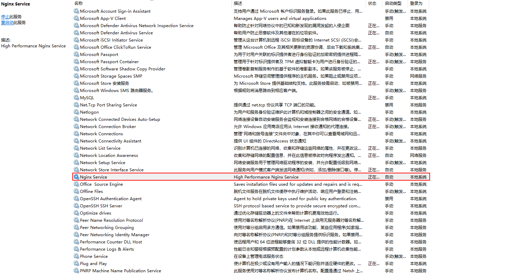
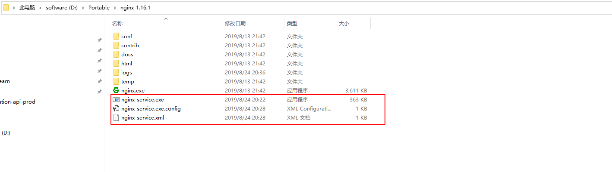

Title: 将Nginx封装为Windows服务并自启动
Published: 2/9/2019
Tags: Nginx
---
> 项目地址： 
https://github.com/kohsuke/winsw

> 下载地址：  
http://repo.jenkins-ci.org/releases/com/sun/winsw/winsw

### 安装步骤
- Step1. 下载小工具。 
- Step2. 将小工具重命名为 nginx-service.exe
- Step3. 创建配置文件nginx-service.xml（名字要和工具名一样) 
- Step4. 创建nginx-service.exe.config（为支持NET 4.0 runtime，默认只支持NET 2.0 runtime）
- Step5. 运行安装命令
- Step6. 在windows 服务中检查是否启动成功

### 图示
#### Windows 服务


#### 文件结构格式如下


### 配置内容
#### nginx-service.xml 内容如下
```
<service>
  <id>nginx</id>   
  <name>Nginx Service</name>   
  <description>High Performance Nginx Service</description>   
  <logpath>D:\Portable\nginx-1.16.1\logs</logpath>   
  <log mode="roll-by-size">
    <sizeThreshold>10240</sizeThreshold>    
    <keepFiles>8</keepFiles>  
  </log>  
  <executable>D:\Portable\nginx-1.16.1\nginx.exe</executable>  
  <startarguments>-p D:\Portable\nginx-1.16.1\nginx</startarguments>  
  <stopexecutable>D:\Portable\nginx-1.16.1\nginx.exe</stopexecutable>
  <stoparguments>-p D:\Portable\nginx-1.16.1\nginx -s stop</stoparguments>
</service>
```

#### nginx-service.exe.config
```
<configuration>
   <startup>
     <supportedRuntime version="v2.0.50727" />    
     <supportedRuntime version="v4.0" />  
  </startup>
  <runtime>
     <generatePublisherEvidence enabled="false"/>   
  </runtime>
</configuration>
```

#### 在cmd中运行如下命令安装windows服务
```
nginx-service.exe install  #安装Windows服务
nginx-service.exe uninstall  #卸载Windows服务
 
nginx-service.exe start  #启动Windows服务
nginx-service.exe stop  #停止Windows服务
```

### 注意问题：
有可能会启动不成功， 这个时候可以到nginx 的日志中查看启动失败原因
很有可能是80端口被占用