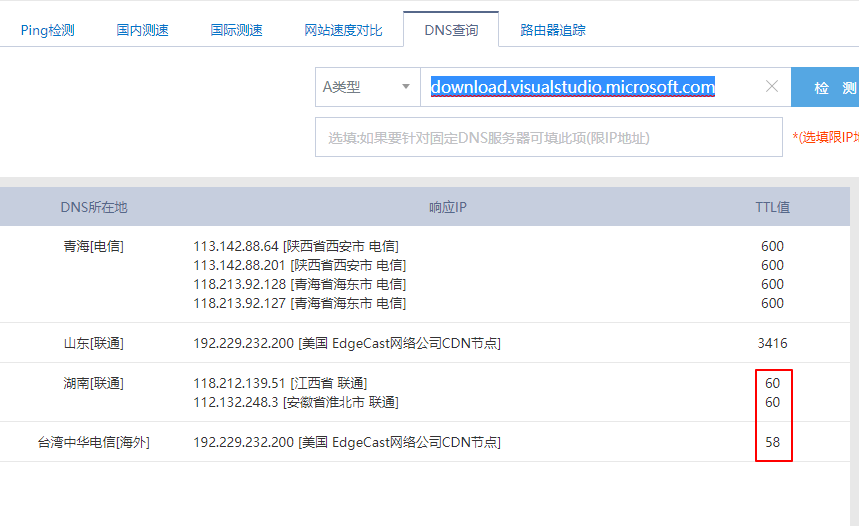

Title: Visual Studio 下载或者更新缓慢解决方案
Published: 2019-10-13
Tags: ["Vsiual Studio", "vs_installer"]
---
## 问题
在国内有时候 安装或者更新 Visual Studio 的很慢

## 解决步骤

### 1. 找到Visual Stuio Installer 下载时的路径
1.1 找到Visual Studio Installer 的log
> path: C:\Users\xxx\AppData\Local\Temp

**注意： Visual Studio Installer 的log 名词为 dd_setup_xxxxxx 格式**

1.2 分析log 找到下载路径
> download.visualstudio.microsoft.com

### 2. 使用DNS 测试工具 查找下载快的IP
DNS tool: http://tool.chinaz.com/dns/

### 3. 修改 hosts 文件，直接指向找到的IP
在hosts 文件中加入
> 118.212.139.51 download.visualstudio.microsoft.com

### 4. 重新开始更新或者安装，会发现速度飙升
